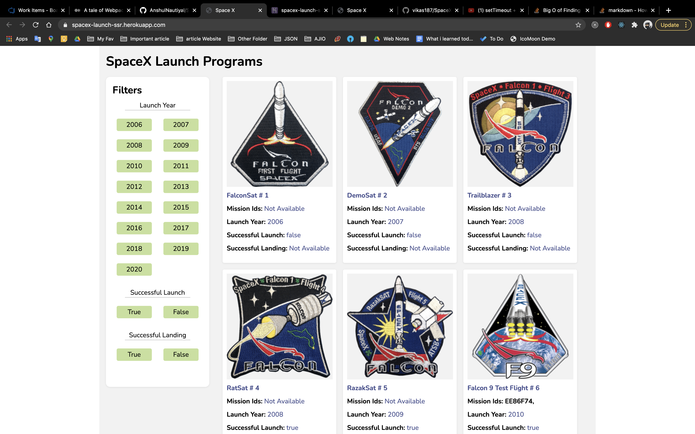
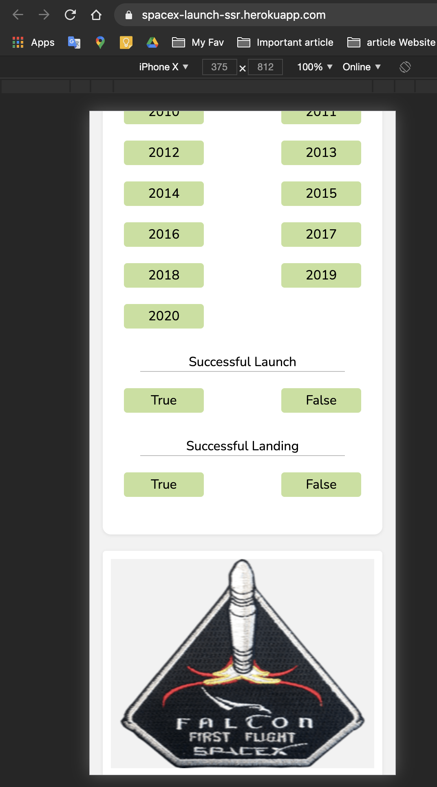
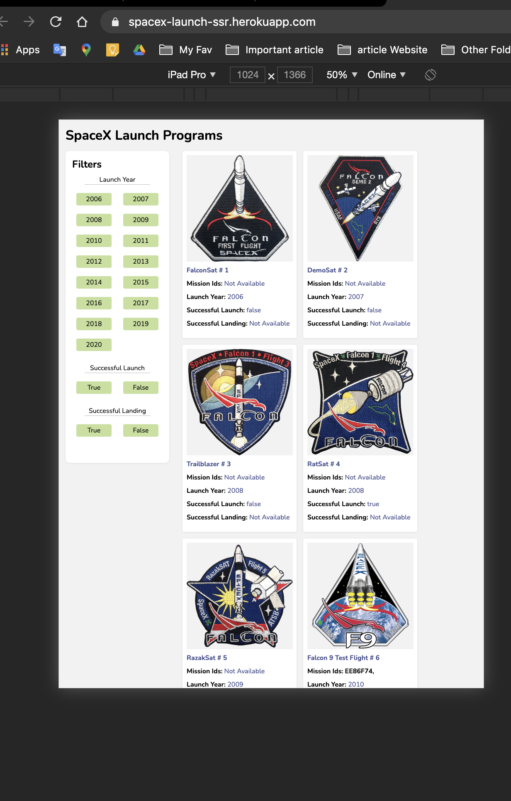
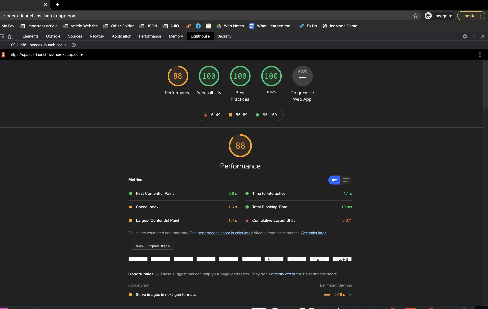

#  SpaceX Program

### Tech Stack
1.  HTML  & CSS
2.  JS(React)
3. Server(Express)
4. Tools(webpack,  Babel)

SpaceX web app is Server-side application. SSR in built on express.
Server serve this initial html page.

## Best Practices

1.  DRY principle
2.  Image Lazy Load
3.  Maintainable Project Folder Structure
4.  Webpack bundling

This project do not use any CLI. Complete project setup is built from scratch.
Page is different Layout for Mobile, Tab and Desktop.

Web app is hosted in Heroku and it  is connected to github. So every commit in main branch will trigger the deployment automatically.

Desktop:

Mobile:

Tab:

LightHouseScore:

Lighthouse performance score can be more than 90 by doing this:
1.  Images in api response  should have WebP and other format rather than JPEG and PNG.
2.  Images is using http1.1 protocol. Http2 is better for it.

